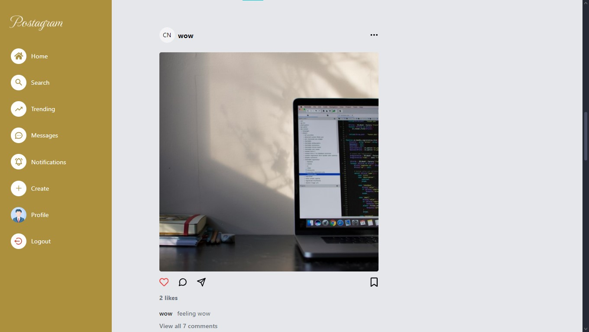

# Full Stack Instagram Clone Website (MERN Stack)

I am building a Full Stack (MERN) Instagram Clone Website which is functional, responsive and secured using JavaScript, HTML, Tailwind CSS, Git and
Github, Context Api, Redux Toolkit, ECMAScript, ExpressJs, NodeJs, Mongoose, MongoDB and ReactJs.
# Landing Page

